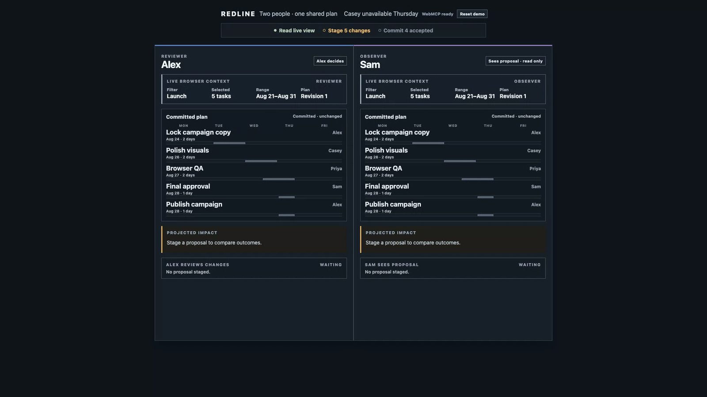
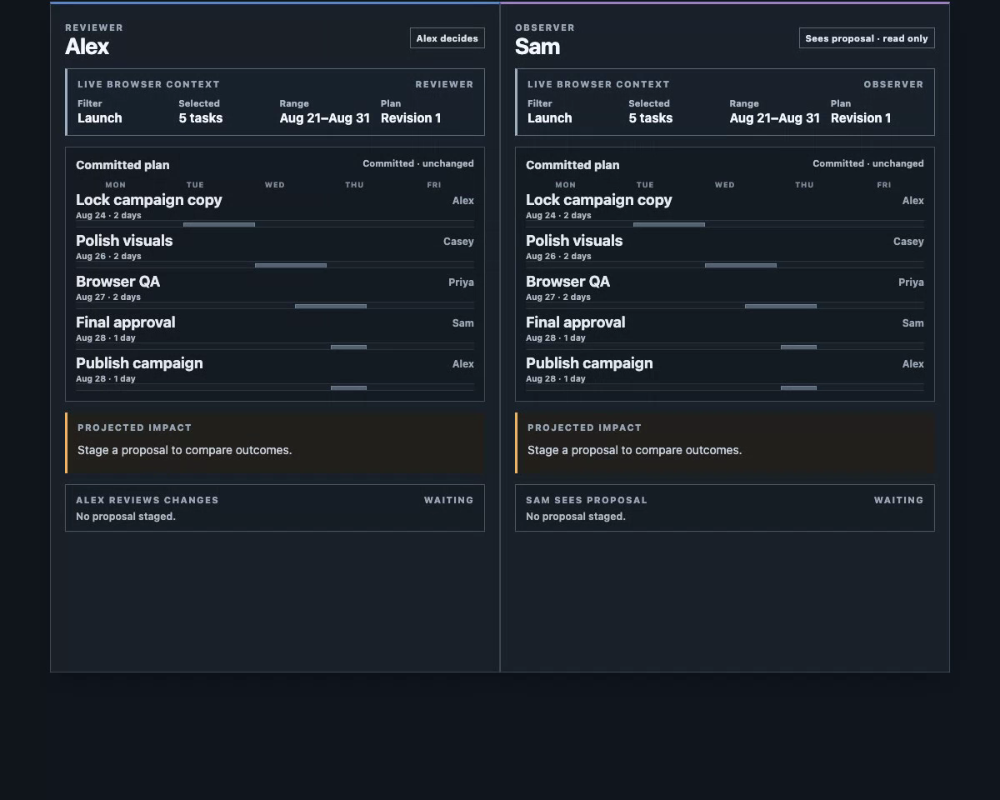
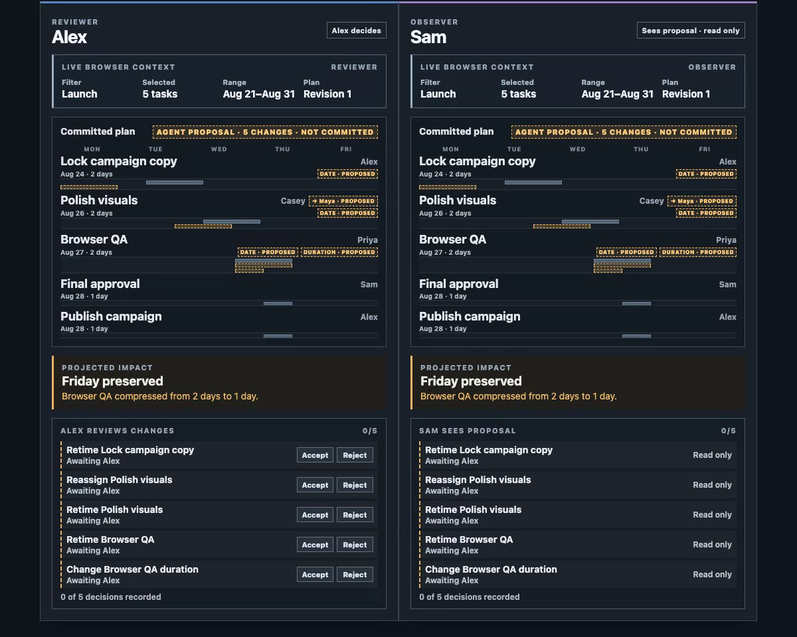
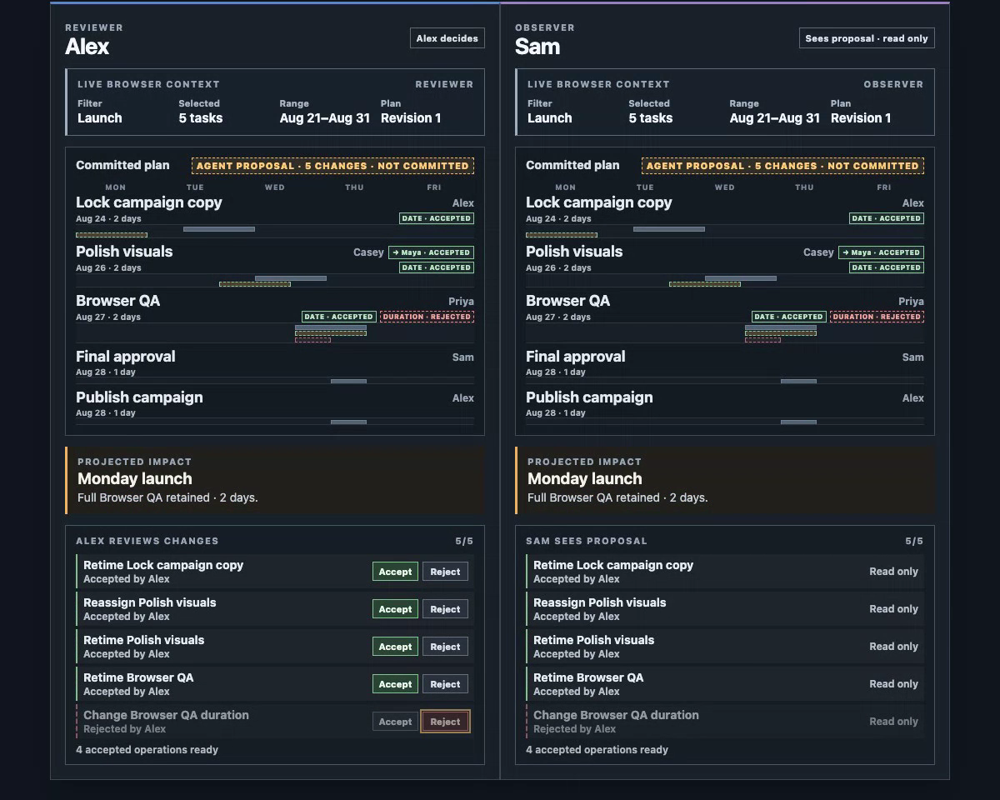
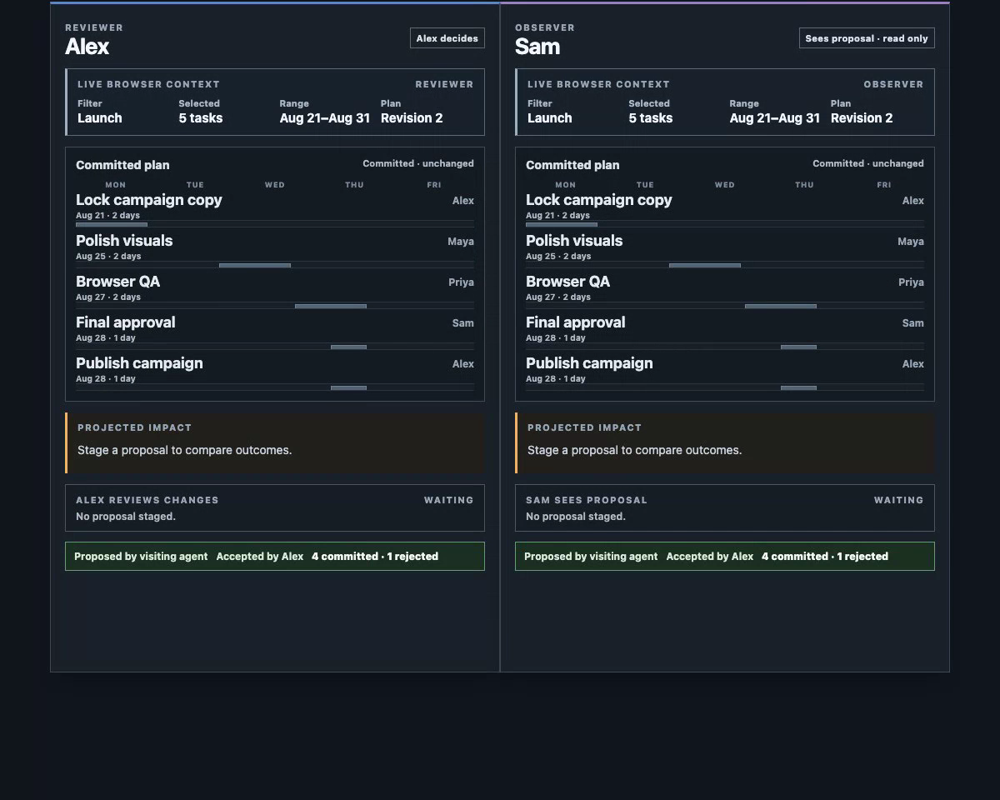
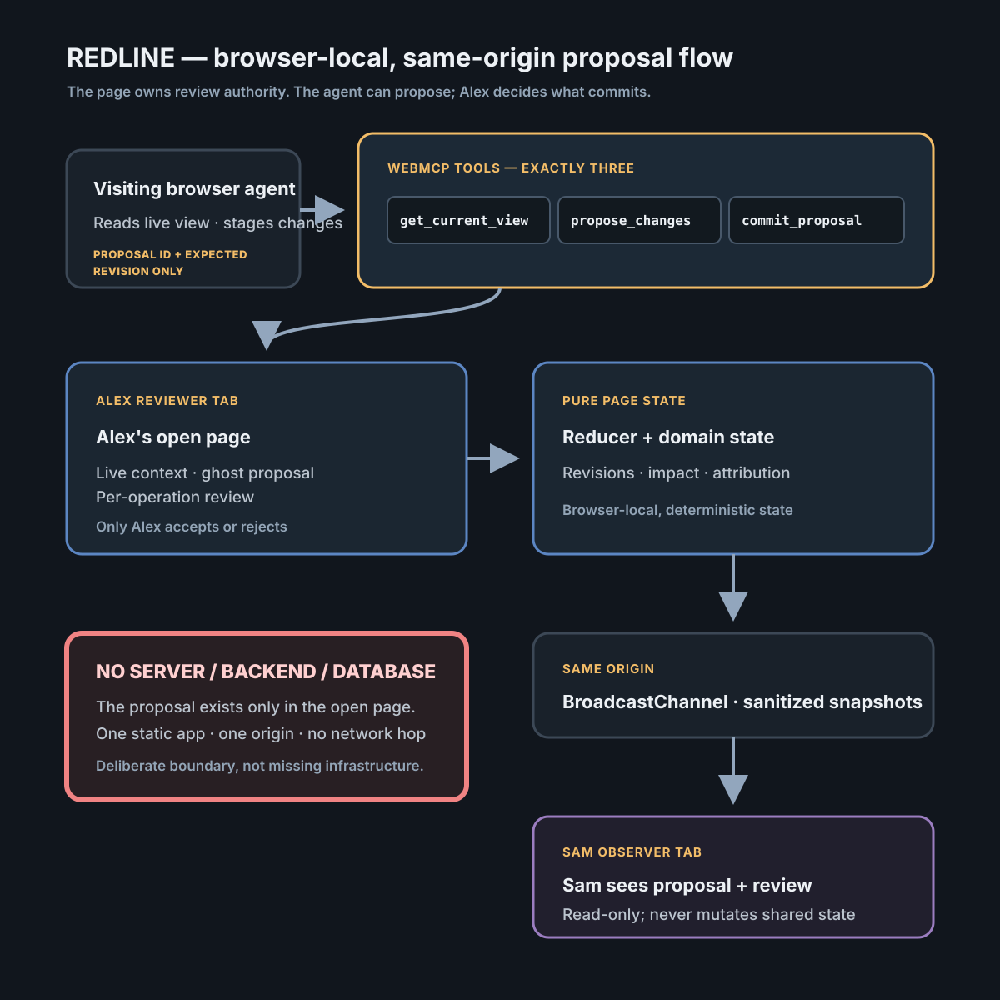

# REDLINE

**A visiting browser agent can stage shared, reviewable change before a human decides what becomes real.**

**Live Demo:** [https://redline-webmcp.netlify.app](https://redline-webmcp.netlify.app)

**Watch Demo:** publishing shortly.



Alex and Sam share one campaign plan. A visiting browser agent reads Alex's actual open-tab context, stages five typed changes, and makes those changes visible as ghosts in both views. Nothing is committed until Alex reviews every operation. Alex rejects the Browser QA shortcut; only the other four operations commit, while Sam observes the same result without gaining mutation authority.

The point is not planning software. It is a human-agent-human interaction: someone who did not summon the agent can see its unfinished work before it becomes their shared plan.

## The lifecycle

### 1. Before

Alex and Sam see the committed plan; no proposal exists.

[](evidence/showcase/before.png)

### 2. Agent proposal

Five ghosts are explicitly not committed; Sam sees them without gaining mutation authority.

[](evidence/showcase/staged.png)

### 3. Human decision

Alex rejects QA compression. The reviewed consequence is Monday with full two-day Browser QA.

[](evidence/showcase/reviewed.png)

### 4. Committed result

Four accepted operations commit, one stays rejected, and attribution names the visiting agent and Alex.

[](evidence/showcase/attribution.png)

## Why WebMCP

WebMCP supplies a small page-native capability surface bound to the state of the open tab. REDLINE registers exactly three static tools:

| Tool | Contract | Visible result |
| --- | --- | --- |
| `get_current_view` | Read the active filter, selection, visible range, role, displayed tasks, plan revision, and proposal status. | The agent is grounded in the browser view Alex already has open. |
| `propose_changes` | Validate and atomically stage one to six typed operations against `expected_plan_revision`. | Five ghosts and one deterministic impact appear in both panes while committed state stays unchanged. |
| `commit_proposal` | Receive only `proposal_id` and `expected_proposal_revision`. | The reducer commits only the operations Alex accepted in the page UI. |

The final tool's schema is the authority boundary:

```ts
// Deliberately omits operation IDs and acceptance values: Alex's page-held
// review map is the only authority that determines the committed subset.
export const commitProposalSchema = {
  type: 'object',
  properties: {
    proposal_id: { type: 'string', minLength: 1 },
    expected_proposal_revision: { type: 'number', minimum: 1 },
  },
  required: ['proposal_id', 'expected_proposal_revision'],
  additionalProperties: false,
};
```

There is no operation-ID list or acceptance-map input. The agent can request finalization; it cannot widen the grant Alex made in the page.

### Repository map

- [`src/webmcp/contracts.ts`](src/webmcp/contracts.ts) — the three schemas and the deliberate omission that protects commit authority.
- [`src/domain/reducer.ts`](src/domain/reducer.ts) — atomic staging, human review, stale checks, commit, receipt persistence, and reset.
- [`src/domain/impact.ts`](src/domain/impact.ts) — the pure deterministic Friday-versus-Monday consequence calculation.
- [`src/sync/protocol.ts`](src/sync/protocol.ts) — sanitized same-origin snapshots, freshness validation, and observer-origin restrictions.
- [`src/domain/reducer.test.ts`](src/domain/reducer.test.ts), [`src/sync/protocol.test.ts`](src/sync/protocol.test.ts), and [`src/webmcp/contracts.test.ts`](src/webmcp/contracts.test.ts) — executable authority and contract invariants.

## Authority and failure semantics

Staging is atomic: an invalid operation rejects the whole batch without changing committed state. Both staging and commit use expected revisions, so stale work returns a structured refusal and nothing mutates. A successful commit persists its receipt; repeating the same call returns that receipt with `already_applied: true`, without applying an operation twice or advancing the plan revision again.

```json
{
  "idempotent_retry": {
    "ok": true,
    "data": {
      "new_plan_revision": 2,
      "already_applied": true
    }
  }
}
```

The refusal union is explicit:

| Code | Meaning |
| --- | --- |
| `VIEW_NOT_READY` | The current tab cannot yet supply live view state. |
| `OBSERVER_READ_ONLY` | Sam cannot stage, review, commit, or reset shared state. |
| `STALE_PLAN_REVISION` | The committed plan changed since the caller's read. |
| `STALE_PROPOSAL` | Human review advanced beyond the caller's proposal revision. |
| `UNKNOWN_TASK` | An operation references a task outside the fixture. |
| `INVALID_OPERATION` | An operation violates the typed domain contract. |
| `DUPLICATE_OPERATION_ID` | A batch repeats an operation identity. |
| `BATCH_TOO_LARGE` | The proposal is outside the one-to-six operation bound. |
| `PROPOSAL_ALREADY_OPEN` | A second proposal cannot replace an unresolved one. |
| `REVIEW_INCOMPLETE` | Every operation must receive a human decision before commit. |
| `NO_ACCEPTED_OPERATIONS` | Finalization refuses an all-rejected proposal. |
| `PROPOSAL_NOT_FOUND` | The requested proposal is neither open nor covered by a stored receipt. |

## Real payload evidence

[`get-current-view.json`](evidence/showcase/raw/get-current-view.json) is derived from a real Inspector/visiting-agent read. [`propose-changes.json`](evidence/showcase/raw/propose-changes.json) and [`commit-proposal.json`](evidence/showcase/raw/commit-proposal.json) are exact page-derived exports from the frozen handlers running against the same canonical fixture; they are not represented as Inspector-agent transcripts.

The payloads prove:

- live grounding in `Filter Launch`, five selected tasks, `Aug 21–Aug 31`, and plan revision 1;
- `committed_state_unchanged: true` after atomic staging;
- four committed operation IDs and one rejected QA-compression ID;
- final structural finish date `2026-08-31`;
- an idempotent retry with `already_applied: true`.

## Engineering guarantees

The suite contains 31 tests: 28 behavioral and contract tests across reducer, impact, synchronization, and WebMCP contracts, plus 3 presentation tests. High-signal examples are:

- `commits only human-accepted operations and retains rejected IDs in the receipt`
- `commit input cannot widen the accepted subset`
- `repeated commit returns the same receipt without mutation`
- `Sam cannot stage, review, commit, or reset shared state`
- `Sam cannot originate proposal, review, commit, or reset mutations`
- `rejecting QA compression yields Monday with full QA retained`

The full checked-in run is available at [`evidence/showcase/raw/test-run.txt`](evidence/showcase/raw/test-run.txt).

## Architecture



The absence of a backend and CRDT is deliberate. The proposal is tab-local state with no server representation; that is precisely why the browser page is the correct authority boundary. Native `BroadcastChannel` shares sanitized snapshots on one origin, while the pure reducer remains the single source of truth. Adding a server or generic conflict-free replication model would replace the specific page-held-authority claim with a broader system REDLINE does not make.

## Evidence

| Proof | Artifact |
| --- | --- |
| Committed baseline, no proposal | [`before.png`](evidence/showcase/before.png) |
| Five ghosts, not committed, Sam read-only | [`staged.png`](evidence/showcase/staged.png) |
| Reviewed outcome before commit — Monday launch, full two-day QA | [`reviewed.png`](evidence/showcase/reviewed.png) |
| Four committed, one rejected, QA compression rejected, full two-day Browser QA retained | [`after.png`](evidence/showcase/after.png) |
| Visiting-agent/Alex attribution and 4/1 result | [`attribution.png`](evidence/showcase/attribution.png) |
| Capture and provenance | [`evidence/showcase/INDEX.md`](evidence/showcase/INDEX.md) |

## Run it in Chrome

1. Use Google Chrome 149 or later.
2. Open `chrome://flags/#enable-webmcp-testing`.
3. Enable **WebMCP testing** and restart Chrome.
4. Open the [public HTTPS demo](https://redline-webmcp.netlify.app).
5. Use a compatible WebMCP inspection or visiting-agent route to discover the three registered tools.

The deterministic manual UI remains available when the browser does not expose WebMCP. Compatibility beyond the documented Chrome route is not claimed.

## Local development

```bash
npm install
npm run dev
```

```bash
npm run test -- --run
npm run build
```

## Boundaries

REDLINE demonstrates one deterministic Friday campaign / Browser QA fixture. It is not a general planning product and does not claim real-time collaboration, multi-agent orchestration, distributed systems, or a backend service. The application itself ships no backend, authentication, or analytics; the static host currently injects its own public badge/HUD script.

## License

MIT — see [LICENSE](LICENSE).
